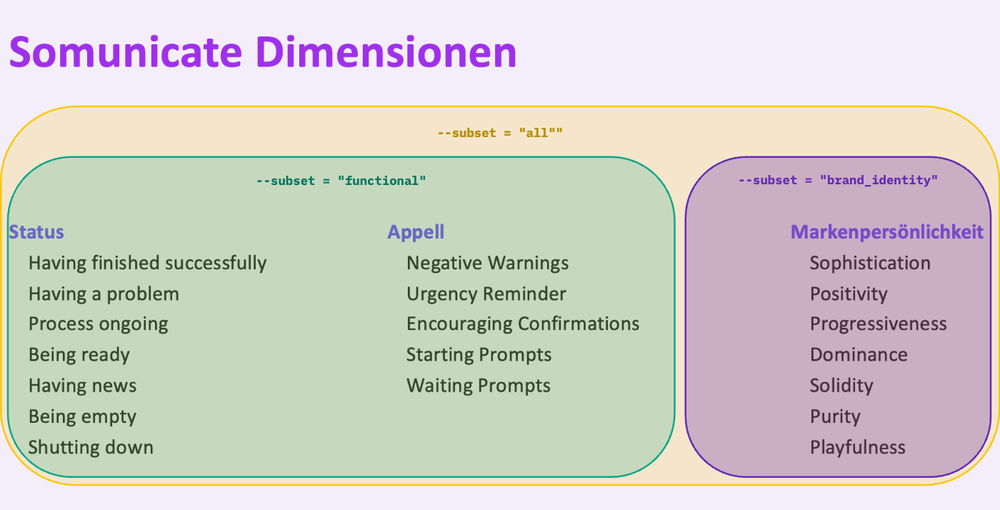

# App
The app runs on the streamlit cloud under [THIS LINK](https://somunicate-predictor.streamlit.app/)

If you want to runt the app yourself installing the packages listed in the `requirements.txt` 

```
pip install -r requirements.txt
```
Running the app locally can be done via 
```
streamlit run app_predictor.py
```


# Script
The functionality of the prediction model can also be used seperately with the `predict.py` script. Internally two models are availabel right now (17.10.24), one using the industry as an input and one that only uses the musical featues. The one WITH the industry is predicting better (concerning the $R^2$ metric).

- `--sound_file` argument specifies the path to the `.wav` or `.mp3` to be predicted.
- `--industry` is set to `None` by default. The options are `["Apps", "Consumer", "Future", "Health", "Home", "Mobility", "Os"]`. If the argument is specified the model which uses industry as an input feature is used automatically.
- `--output_folder` is where the resulting prediction dictionary is saved (`.json` file). The model that was used is also saved in the JSON file. It is set to `data/predictions/` per default. 
- `--subset`argument specifies which multioutput model is used. Per default all dimensions are predicted using the `all` multioutput model. The other options are `funcitonal` (appeal and status combined) and `brand_identity`.



There are two underlying ideas: 1) A model that predicts all 19 dimensions simultaneously 2) separating the functional communication level and the aesthetic (brand identity) level. During the model selection the results revealed that those two levels utilize completely different learning paradigms (deep learning versus random forest) and thus could be used separately. 


The script works on it's own and predicts the dimension ratings for an example sound (`data/audios/AMG_Mobility-003.mp3`) usind no industry and saves the prediction (`data/predictions`)
```
python predict.py
```

Run the script with other arguments:
```
python predict.py --sound_file=<path/to/audio> --industry=<Industry> --output_folder=<path/to/folder>
```
